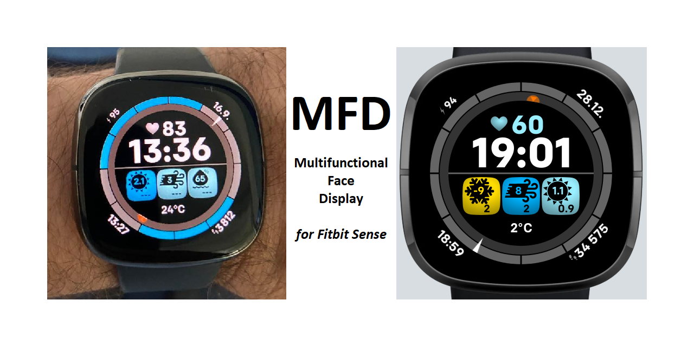

# Fitbit-MFD
Multifunctional Face Display for Fitbit Sense - Focus on weather and environment awareness with alert prioritization and clean style

This is the work-in-progress fitbit face that offers quite advanced functionality to keep you informed about your surroundings while keeping the display nice and clean (yes, content-rich, but not cluttered).

I use it for quite some time now (originally started for Versa) but never got to closing all loose ends to actually give it to you folks directly in Fitbit repository.
It was close to its finalization for far too long so I decided to make it available on GitHub.

The app utilizes the free OpenWeatherMap information available over its API. The phone-based companion gets the hourly report every 20 minutes or as configured, and extracts the information, analyzes it, and sends the update to its watch counterpart. The focus is on low data consumption and minimal computation on face side (to maximize responsiveness and minimize battery consumption).

Aside from time itself, the face offers basic stats such as heartrate (color coded) and steps, 12-hour outlook of precipitation and sunrise/sunset events, and 3 most important weather/environment alerts.

Currently suppported alerts:
- Wind
- Temperature
- UV
- Freeze
- Humidity

Planned alerts:
- Storm
- Air Quality
- Pressure

# SETUP
If you'd like to give it a try, there's just one alteration you'll need to do:
	1. Set up a free account on https://home.openweathermap.org/users/sign_up and get the API key
	2. Copy this API key to the API_KEY variable on line 10 of companion/index.js file

# TODO and KNOWN ISSUES
1. Resolve connectivity issues between phone and watch (is it just my setup, or everyone suffers from it?)
	- temporary workaround: if this happens - open "Settings" or other app on the watch and the connection gets restored
2. Replace temporary 'last update' time from bottom-left corner with active minutes or other useful information
3. Finish the current mockup state of Settings page, including imperial units option
4. Add additional alerts
5. Restyle the alert icons to fit the overall face style
6. Add support of displaying calendar events in 12-hrs outlook

# CLOSING NOTE
If you invest few minutes to get the project set up, I believe the face will serve you well. It saved me quite a few times from getting soaked or surprised by other weather events and kept my kids out from direct sunlight when the UV was far from OK.

And to Fitbit folks from Google: if you'd be interested to take my idea to next level and offer something similar as stock face, I'm all for it. And if interested, just let me know and I will be happy assist you with providing better insight in the overall philosophy or any particular feature you'd like to know more about.
